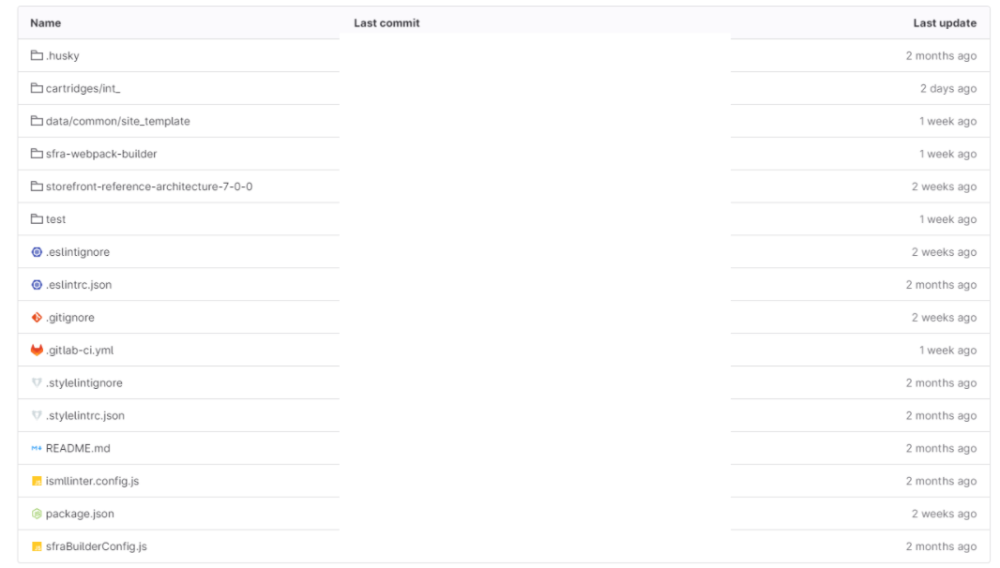

### Author: Gaurav Jangid
### Title: DevOps SFCC CI/CD
### Date: 2024-07-24

---

# Salesforce DevOps pipelines setup (GitLab) - SFCC
This document will guide you to setting up pipelines for SFCC projects. These pipelines executes different stages like **Lint** checks, **Build Test** and **Deployment** in different instances.

**All the project dependencies should be declared in package.json**

Create a Project in GitLab.
The folder structure of the project should look similar to this



For setting up pipelines we need a yml file named **.gitlab-ci.yml** which is to be created in root of the repository.

following is the basic template of yml file.

``` yml
stages:
  - perform_lint_check
  - perform_build_test
  - perform_deployment_abcd001
  - perform_deployment_staging
  - data_deploy

perform_lint_check:
  stage: perform_lint_check
  image: node:18.19.1
  script:
    - npm install
    - npm run lint
  rules:
    - if: '$CI_PIPELINE_SOURCE == "merge_request_event" && $CI_MERGE_REQUEST_TARGET_BRANCH_NAME == "develop"'

perform_build_test:
  stage: perform_build_test
  image: ubuntu:20.04
  before_script:
    - apt-get update &> ~/apt-update-log.txt
    - apt-get install -y curl zip &> ~/apt-preinstall-log.txt
  script:
    - curl -sL https://deb.nodesource.com/setup_18.x | bash -
    - apt-get install -y nodejs=18.19.1-1nodesource1
    - apt-get install build-essential -y
    - node -v
    - npm install --loglevel=error
    - npm run setup:project --loglevel=error
    - npm run build
  rules:
    - if: '$CI_PIPELINE_SOURCE == "merge_request_event" && $CI_MERGE_REQUEST_TARGET_BRANCH_NAME == "develop"'

perform_deployment_abcd001:
  stage: perform_deployment_abcd001
  image: ubuntu:20.04
  before_script:
    - apt-get update &> ~/apt-update-log.txt
    - apt-get install -y curl zip &> ~/apt-preinstall-log.txt
  script:
    - curl -sL https://deb.nodesource.com/setup_18.x | bash -
    - apt-get install -y nodejs=18.19.1-1nodesource1
    - node -v
    - apt-get install build-essential -y
    - npm install --loglevel=error
    - npm run setup:project --loglevel=error
    - npm run build

    # Create Auth Token
    - echo "Authenticating $HOSTNAME_ABCD001.... ⏱️"
    - npx sfcc-ci client:auth $CLIENT_ID_ABCD001 $SECRET_ABCD001
    - echo "Successfully authenticated $HOSTNAME_ABCD001 ✅"

    # Zip the cartridges
    - npm run code:createZip
    # Deploy code
    - echo "Deployment started ... 🔜"
    - npx sfcc-ci code:deploy build$CI_COMMIT_SHA.zip -i $HOSTNAME_ABCD001 && rm -rf build$CI_COMMIT_SHA.zip
    # Activate current code version
    - npx sfcc-ci code:activate build$CI_COMMIT_SHA -i $HOSTNAME_ABCD001
    - echo "Deployment Finished 🎯"

  rules:
    - if: '$CI_COMMIT_BRANCH == "develop"'

perform_deployment_staging:
  stage: perform_deployment_staging
  image: ubuntu:20.04
  before_script:
    - apt-get update &> ~/apt-update-log.txt
    - apt-get install -y curl zip &> ~/apt-preinstall-log.txt
  script:
    - curl -sL https://deb.nodesource.com/setup_18.x | bash -
    - apt-get install -y nodejs=18.19.1-1nodesource1
    - node -v
    - apt-get install build-essential -y
    - npm install --loglevel=error
    - npm run setup:project --loglevel=error
    - npm run build

    # Create Auth Token
    - echo "Authenticating $HOSTNAME_STAGING.... ⏱️"
    - npx sfcc-ci client:auth $CLIENT_ID_STAGING $SECRET_STAGING
    - echo "Successfully authenticated $HOSTNAME_STAGING ✅"

    # Zip the cartridges
    - npm run code:createZip
    # Deploy code
    - echo "Deployment started ... 🔜"
    - npx sfcc-ci code:deploy build$CI_COMMIT_SHA.zip -i $HOSTNAME_STAGING && rm -rf build$CI_COMMIT_SHA.zip
    # Activate current code version
    - npx sfcc-ci code:activate build$CI_COMMIT_SHA -i $HOSTNAME_STAGING
    - echo "Deployment Finished 🎯"

  rules:
    - if: '$CI_COMMIT_BRANCH == "QA"'

data_deploy:
  stage: data_deploy
  image: ubuntu:20.04
  before_script:
    - apt-get update &> ~/apt-update-log.txt
    - apt-get install -y curl zip &> ~/apt-preinstall-log.txt
  script:
    - curl -sL https://deb.nodesource.com/setup_18.x | bash -
    - apt-get install -y nodejs=18.19.1-1nodesource1
    - node -v
    - apt-get install build-essential -y
    - npm install --loglevel=error

    - echo "Authenticating staging .... ⏱️"
    - npx sfcc-ci client:auth $CLIENT_ID_STAGING $SECRET_STAGING
    - echo "Successfully authenticated staging ✅"
    - echo "Data deployment started ... 🔜"
    - npm run data:upload --env staging $HOSTNAME_STAGING

    - echo "Data deployment finished 🎯"

  rules:
    - if: '$CI_PIPELINE_SOURCE == "schedule"'
```

All the custom variables used in above .yml should be defined either in the .yml itself or in the ci-cd settings variables of the project repository on GitLab. for ex - $CLIENT_ID_STAGING, $HOSTNAME_STAGING etc.

Following is the template for <font color="red">package.json</font>
``` json
{
  "name": "projectname-sfra",
  "version": "1.2.0",
  "description": "projectname SFRA Code Base",
  "main": "index.js",
  "scripts": {
    "setup:project": "npm install && cd sfra-webpack-builder && npm install && cd .. && npm run npmInstall",
    "build": "webpack --config ./sfra-webpack-builder/webpack.config.js --env dev --env local",
    "npmInstall": "node ./sfra-webpack-builder/installHandling/install.js",
    "prod": "webpack --config ./sfra-webpack-builder/webpack.config.js --env local",
    "dev": "webpack --config ./sfra-webpack-builder/webpack.config.js --env dev --env local",
    "watch": "webpack --config ./sfra-webpack-builder/webpack.config.js --env dev --watch --env local",
    "watch:lint": "webpack --config ./sfra-webpack-builder/webpack.config.js --env dev --env useLinter --watch --env local",
    "watch:reload": "webpack --config ./sfra-webpack-builder/webpack.config.js --env dev --watch --env local --env livereload",
    "lint": "npm run lint:js && npm run lint:css",
    "lint:fix": "npm run lint:js:fix && npm run lint:css:fix",
    "lint:js": "eslint .",
    "lint:js:fix": "eslint . --fix",
    "lint:css": "stylelint ./cartridges/**/*.scss",
    "lint:css:fix": "stylelint ./cartridges/**/*.scss --fix",
    "lint:isml": "./node_modules/.bin/isml-linter",
    "lint:isml:build": "./node_modules/.bin/isml-linter --build",
    "lint:isml:fix": "./node_modules/.bin/isml-linter --autofix",
    "data:upload": "node bin/dataUpload",
    "code:createZip": "shx mkdir -p build$CI_COMMIT_SHA && shx cp -R ./cartridges/* build$CI_COMMIT_SHA && shx cp -R **/cartridges/* build$CI_COMMIT_SHA && zip -r -q build$CI_COMMIT_SHA.zip build$CI_COMMIT_SHA && shx rm -r build$CI_COMMIT_SHA",
    "test:integration": "sgmf-scripts --integration 'test/integration/*.js'",
    "test": "sgmf-scripts --test test/unit/**/*.js",
    "cover": "sgmf-scripts --cover 'test/unit/**/*.js'"
  },
  "repository": {
    "type": "git",
    "url": "repourl.git"
  },
  "author": "authorname",
  "license": "ISC",
  "homepage": "https://homepage.git",
  "sfraBuilderConfig": "./sfraBuilderConfig",
  "dependencies": {
    "aos": "^2.3.4",
    "bootstrap": "^4.6.1",
    "chai": "^3.5.0",
    "chai-subset": "^1.6.0",
    "cheerio": "^1.0.0-rc.12",
    "css-loader": "^7.1.2",
    "flag-icon-css": "^4.1.7",
    "font-awesome": "^4.7.0",
    "jquery": "^3.6.3",
    "mocha": "^10.4.0",
    "postcss-loader": "^8.1.1",
    "proxyquire": "^2.1.3",
    "request-promise": "^4.2.6",
    "sass-loader": "^14.2.1",
    "sfcc-ci": "^2.11.0",
    "sgmf-scripts": "^3.0.0",
    "sinon": "^18.0.0"
  },
  "devDependencies": {
    "eslint": "^8.34.0",
    "eslint-config-airbnb-base": "^15.0.0",
    "eslint-plugin-import": "^2.27.5",
    "eslint-plugin-sitegenesis": "^1.0.0",
    "eslint-plugin-xss": "^0.1.12",
    "husky": "^8.0.0",
    "isml-linter": "^5.43.6",
    "shx": "^0.3.4",
    "stylelint": "^14.16.1",
    "stylelint-config-standard-scss": "^6.1.0",
    "webpack": "^5.76.3",
    "webpack-cli": "^5.0.1",
    "webpack-livereload-plugin": "^3.0.2"
  }
}

```

To run these pipelines we need the following commands to be defined in package.json

>"lint": "npm run lint:js && npm run lint:css"

>"setup:project": "npm install && cd sfra-webpack-builder && npm install && cd .. && npm run npmInstall"

>"build": "webpack --config ./sfra-webpack-builder/webpack.config.js --env dev --env local"

To create a zip of all the cartridges
> "code:createZip": "shx mkdir -p build$CI_COMMIT_SHA && shx cp -R ./cartridges/* build$CI_COMMIT_SHA && shx cp -R **/cartridges/* build$CI_COMMIT_SHA && zip -r -q build$CI_COMMIT_SHA.zip build$CI_COMMIT_SHA && shx rm -r build$CI_COMMIT_SHA"

To perform data deployment
>"data:upload": "node bin/dataUpload"

The ==bin/dataUpload== is a javascript file which performs data deployment

``` js
#!/usr/bin/env node
/* eslint-disable no-console */

const { exec } = require('child_process');

// npm run data:upload --env common | staging | test
const environment = process.argv[2];
const sandbox = process.argv[3];
let folder;
let siteTemplate = 'site_template';

// we are maintaining different data folders for different environments
if (environment === 'common') {
    folder = 'data/common';
} else if (environment === 'staging') {
    folder = 'data/staging';
} else {
    throw Error('Environment unknown');
}

console.log(`Running data upload for Folder: ${folder} in env: ${environment}`);

exec(`\
    cd ${folder} && zip -r -q ${siteTemplate}.zip ${siteTemplate} && \
    mv ${siteTemplate}.zip ../../${siteTemplate}.zip && cd ../../ && \
    npx sfcc-ci instance:upload ${siteTemplate}.zip && ${shx} rm -rf ${siteTemplate}.zip && \
    npx sfcc-ci instance:import ${siteTemplate}.zip -s `, (err, success) => {
      if (err) {
          throw new Error(err);
      }
      console.log(success);
    }
  );
```
The data deployment stage will run at a scheduled time and we can schedule other stages of this pipeline as well.
